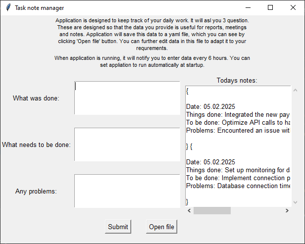
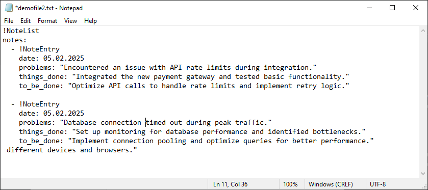

# About Task Note Manager

**Task Note Manager** is a simple yet powerful application designed to help users manage their daily tasks, track progress, and identify challenges efficiently. Whether you're a professional, student, or just someone looking to stay organized, this tool is built to streamline your workflow and keep you on top of your responsibilities.

## Key Features

### 📝 **Daily Task Tracking**
- **Three Input Fields**:  
  - **What was done**: Record completed tasks.  
  - **What needs to be done**: Plan your next steps.  
  - **What problems occurred**: Note any challenges or blockers.  
- **Daily Reminders**: Never miss an update with daily prompts to log your progress.

### 💾 **Easy Data Management**
- **YAML File Storage**: All your data is saved in a clean, human-readable YAML format, making it easy to view, edit, and manage.  
- **Future Export Options**: Soon, you'll be able to export your data to **Markdown** and **Excel** formats for better integration with other tools and reporting.

### 🚀 **Future-Proof Design**
- **Scalable and Flexible**: Built with future enhancements in mind, Task Note Manager will continue to evolve with new features to meet your needs.  
- **User-Centric**: Designed to be intuitive and user-friendly, ensuring a seamless experience for all users.

## Why Task Note Manager?
Task Note Manager was created to solve the problem of scattered notes and disorganized task tracking. By providing a structured yet flexible way to log daily activities, it helps users stay focused, identify patterns, and improve productivity over time.

Whether you're managing personal goals or team projects, Task Note Manager is here to make your life easier. Start organizing your tasks today and take control of your workflow!

# Local run instructions

Make sure you have Python 3.11 or higher installed. You would also need pipenv.

1. `pipenv install`
2. `pienv run python main.py`

# Build instructions

Before you build this app, note that antivirus may flag it as potencially malicious executable. This is normal, you should add an exception for file in your antivirus program.

1. `pipenv install --dev`
2. Get directory of virtual environment by running `pipenv --venv`
3. Run `pipenv run pyinstaller --paths <virtual env path> --noconsole --onefile --windowed main.py`. Option --noconsole will build app so that console window will not be displayed when running executable. Option --onefile will bundle all files into one executable. 