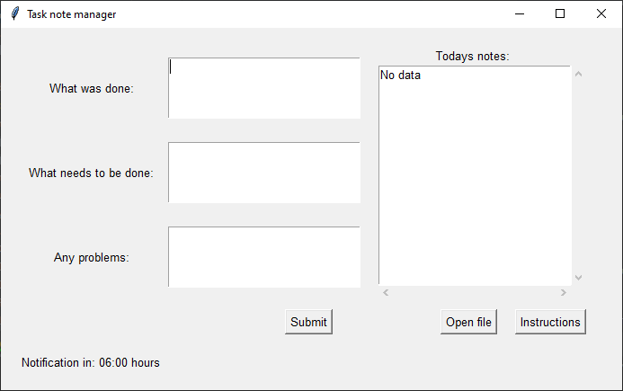

# About Task Note Manager

**Task Note Manager** is a simple yet powerful application designed to help users manage their daily tasks, track progress, and identify challenges efficiently. Whether you're a professional, student, or just someone looking to stay organized, this tool is built to streamline your workflow and keep you on top of your responsibilities.

 
## Download and usage instructions

See [release list](https://github.com/matej2/task-note-manager/releases) to download latest version. 

At the start of your workday, run the application. You can either launch it manually or set it to autorun at startup.  
6 hours after the application starts, you will be prompted to provide your daily task data.

## Key Features

### 📝 **Daily Task Tracking**
- **Three Input Fields**:  
  - **What was done**: Record completed tasks.  
  - **What needs to be done**: Plan your next steps.  
  - **What problems occurred**: Note any challenges or blockers.  
- **Daily Reminders**: Never miss an update with daily prompts to log your progress.

### 💾 **Easy Data Management**
- **YAML File Storage**: All your data is saved in a clean, human-readable YAML format, making it easy to view, edit, and manage.  
- **Future Export Options**: Soon, you'll be able to export your data to **Markdown** and **Excel** formats for better integration with other tools and reporting.

### 🚀 **Future-Proof Design**
- **Scalable and Flexible**: Built with future enhancements in mind, Task Note Manager will continue to evolve with new features to meet your needs.  
- **User-Centric**: Designed to be intuitive and user-friendly, ensuring a seamless experience for all users.

## Why Task Note Manager?
Task Note Manager was created to solve the problem of scattered notes and disorganized task tracking. By providing a structured yet flexible way to log daily activities, it helps users stay focused, identify patterns, and improve productivity over time.

Whether you're managing personal goals or team projects, Task Note Manager is here to make your life easier. Start organizing your tasks today and take control of your workflow!

# Local run instructions

Make sure you have Python 3.11 or higher installed. You would also need pipenv.

1. `pipenv install`
2. `pipenv run python main.py`

# Build instructions

When building this application locally, note that antivirus may flag it as potentially malicious executable. This is normal, you should add an exception for the file in your antivirus program. The application may also need admin permissions to run in order to create and update the output file.

1. `pipenv install --dev`
2. Run `pipenv run pyinstaller --noconsole --onefile --windowed --name "Task Note Manager" main.py`.  
   - `--noconsole`: Hides the console window when running the executable.  
   - `--onefile`: Bundles all files into a single executable.  
   - `--windowed`: Ensures the app runs as a GUI application.